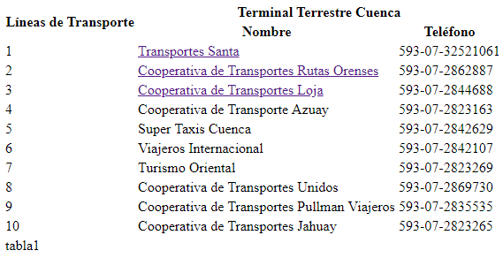

# Practica01-Mi_Blog
## 1.	Implementación de seis páginas HTML

Se implementan 6 páginas HTML que contienen información acerca del Terminal Terrestre de Cuenca, todas las páginas poseen un mení de navegación que permite que el usuario se mueva entre todas las páginas:


## 2. Estructura de las páginas HTML


Para que las páginas sigan el formato indicado, se debe incluir la siguiente estructura:

```HTML
<body>
  <header>
  <header>
  <nav>
  </nav>
  <section>
    <article>
    </article>
    <aside>
    </aside>
  </section>
  <footer>
  </footer>
</body>
```

Dentro de la etiqueta header se incluye el logo de la página y un título de la siguiente forma:

```HTML
<header>
<div>

<br>
<h1>Terminal Terrestre Cuenca</h1>
<br>
</div>
</header>
```
Además, dentro de la etiqueta footer se incluye la información del estudiante de la siguiente manera:

```HTML
<footer>
<h4>
Programador: <q>Doménica Merchán</q> &#8226;
Correo: <a href="mailto:dmerchang1@est.ups.edu.ec">dmerchang1@est.ups.edu.ec</a> &#8226;
Telefono: <a href="tel:0996585255">0996585255</a>
</h4>

<h5><sub>&#169;</sub><em> Todos los derechos reservados</em></h5>
</footer>
```

## 3. Implementación de una tabla


Se pide ingresar una tabla con el formato indicado; para ello se utilizan las siguientes etiquetas:

-	table: Se indica que se implementará una nueva tabla.
-	thead: Indica que se va a ingresar la cabecera de la tabla.
-	tbody: Indica el cuerpo de la tabla.
-	tfoot: Indica que se ingresa el pie de la tabla.
-	tr: Inicia una nueva fila.
-	th: Inicia una nueva columna para un título.
-	td: Inicia una nueva columna para el contenido.

Además se utilizan los siguientes atributos:

-	rowspan=”x”: Indica que se unen x filas.
-	colspan=”x”: Indica que se unen x columnas.

La tabla se visualiza de la siguiente forma:



## 4.	Implementación de un vídeo de YoutTube

Para la implementación de un vídeo de YouTube se utiliza la siguiente etiqueta:

```HTML
<iframe src="https://www.youtube.com/embed/4pSmZ7lhhQE" allow="accelerometer; autoplay; encrypted-media; gyroscope; picture-in-picture" allowfullscreen></iframe>
```

El video implementado se visualiza de la siguiente manera:


## 5.	Manejo de listas ordenadas

Las listas desordenadas se implementan por medio de las siguientes etiquetas:

-	ul: Indica que se implementará una lista desordenada.
-	li: Contiene cada ítem de la lista.

La lista implementada se visualiza de la siguiente forma:


## 6.	Etiquetas

Las etiquetas implementadas en el proyecto fueron:

-	a: Contiene un hipervínculo.
-	br: Hace un salto de línea.
-	cite: Ingresa una cita.
-	em: Enfatiza un texto.
-	q: Introduce el texto entre comillas.
-	strong: Indica que el texto es importante poniéndolo en negrita

## 7.	Validación 

Para validar el correcto uso de las etiquetas y atributos, todas las páginas e sometieron a una validación de w3. Todas las páginas no presentaron ningún error o warning


## 8.	Conclusiones

La estructura deseada no se visualiza claramente debido a que todas las etiquetas se agregan en la página de forma automática. Para cambiar esto es necesario implementar un estilo con la ayuda de CSS. Sin embargo, los requisitos se pueden cumplir únicamente con HTML aunque la presentación no sea la deseada.

## 9.	GitHub

-	Usuario: domerchan
-	URL: https://github.com/domerchan/Practica01-Mi_Blog.git


